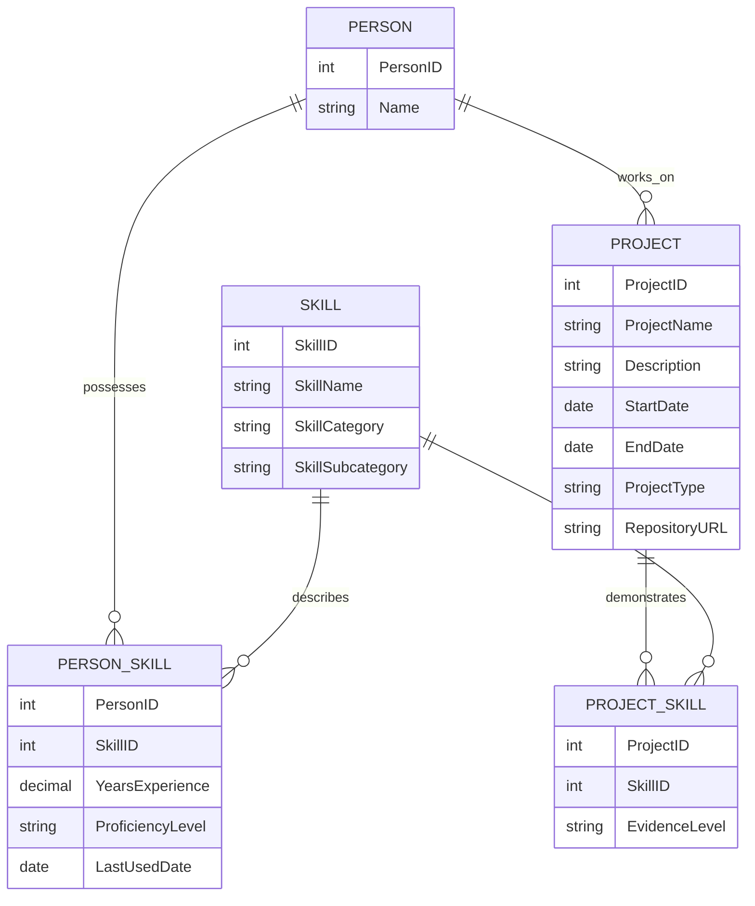
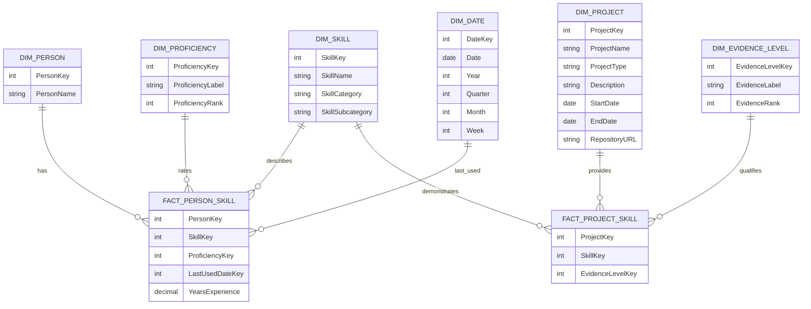

# 1. Conceptual Data Model

## Purpose

The conceptual data model describes the business domain independently of any technical implementation. It identifies the relevant business entities, their relationships and their properties without considering how they will later be represented in a dimensional model.

## Business Domain (Level 1 – Understanding the Job Market)

### Entities

The following entities are part of the first business domain.

---

**JobPosting**: Represents a published job advertisement.

<ins>Properties</ins>

- title
- description
- publicationDate
- salary
- employmentType
- remoteOption

<ins>Relationships</ins>

- published by → Company
- located in → Location
- belongs to → Industry
- classified as → JobProfile
- requires → Skill
- targets → ExperienceLevel

---

**Skill**: Represents a professional skill required by one or more job postings.

<ins>Properties</ins>

- name
- category

Examples:

- SQL
- Python
- Power BI
- Communication
- Leadership

---

**Company**: Represents the employer.

<ins>Properties</ins>

- name

<ins>Relationships</ins>

- publishes → JobPosting

---

**Industry**: Represents the industry sector.

<ins>Properties</ins>

- name

---

**Location**: Represents the geographical location.

<ins>Properties</ins>

- city
- state
- country

---

**JobProfile**: Represents the primary job category.

Examples:

- BI Analyst
- Data Analyst
- Data Engineer
- Data Scientist

---

**ExperienceLevel**: Represents the seniority targeted by a job posting.

Examples:

- Entry
- Junior
- Mid
- Senior
- Lead

## Level 2 – Understanding Yourself

Level 2 extends the labour market model with a representation of the individual user.

While Level 1 describes **market demand**, Level 2 describes **personal capabilities and evidence**. The central linking concept between both perspectives is `Skill`:

- job postings **require** skills;
- persons **possess** skills;
- projects **demonstrate** skills.

This common representation of skills will later enable comparisons between labour market demand and a person's individual profile.

## Business Questions

Level 2 addresses the following questions:

- What skills do I have?
- How much experience do I have?
- Which projects prove my skills?
- How do my skills develop over time?

---

## Conceptual Data Model

### Person

`Person` represents the individual whose professional profile is analysed.

A person can possess multiple skills and can work on multiple projects.

Possible properties include:

- `PersonID`
- `Name`

The initial version of the system may contain only one person. The conceptual model nevertheless treats `Person` as an independent entity to keep the model extensible.

---

### Skill

`Skill` is shared between the labour market model and the personal profile model.

A skill represents a professional capability that may be required by job postings and possessed by persons.

Possible properties include:

- `SkillID`
- `SkillName`
- `SkillCategory`
- `SkillSubcategory`

Example categories may include:

- Technical Skill
- Methodological Skill
- Domain Knowledge
- Soft Skill

Example subcategories may include:

- Programming Language
- BI Tool
- Database Technology
- Cloud Technology
- Statistics
- Communication
- Leadership

The first version deliberately uses a pragmatic skill taxonomy rather than attempting to construct a complete skill ontology. The taxonomy can be refined as the project evolves.

---

### PersonSkill

The relationship between `Person` and `Skill` must not be modelled as a simple binary property.

Knowing that a person "has" a skill is insufficient for meaningful personal analytics. The system must also be able to describe the extent and recency of that capability.

`PersonSkill` therefore represents the relationship between a person and a particular skill.

Possible properties include:

- `YearsExperience`
- `ProficiencyLevel`
- `LastUsedDate`

For example:

| Person   | Skill    | YearsExperience | ProficiencyLevel | LastUsedDate |
| -------- | -------- | --------------: | ---------------- | ------------ |
| Person A | Python   |               5 | Advanced         | 2026         |
| Person A | Power BI |               1 | Intermediate     | 2026         |
| Person A | Azure    |               0 | Beginner         | 2025         |

This makes it possible to distinguish between merely knowing a technology and having substantial, recent experience with it.

Conceptually:

```text
Person M:N Skill
```

with `PersonSkill` acting as the associative entity describing this relationship.

---

### Project

`Project` represents practical work that can provide evidence for one or more skills.

Possible properties include:

- `ProjectID`
- `ProjectName`
- `Description`
- `StartDate`
- `EndDate`
- `ProjectType`
- `RepositoryURL`

Possible project types include:

- Professional Project
- Portfolio Project
- Research Project
- Academic Project

A person may work on multiple projects.

A project may demonstrate multiple skills, while the same skill may be demonstrated by multiple projects.

Therefore:

```text
Project M:N Skill
```

---

### ProjectSkill

`ProjectSkill` represents the relationship between a project and the skills demonstrated by that project.

The relationship may optionally contain an `EvidenceLevel` describing how strongly a particular project demonstrates a skill.

Possible values could initially be:

- Primary
- Supporting
- Minor

For example:

| Project                      | Skill          | EvidenceLevel |
| ---------------------------- | -------------- | ------------- |
| Career Intelligence Platform | Power BI       | Primary       |
| Career Intelligence Platform | Power Query    | Primary       |
| Career Intelligence Platform | Data Modelling | Primary       |
| Career Intelligence Platform | Git            | Supporting    |

This distinction prevents all project-skill relationships from being treated as equally strong evidence.

`EvidenceLevel` should remain deliberately simple in the first version. The project should avoid introducing artificial precision into the assessment of skill evidence.

---

## Skill Evidence

Skill evidence should not be stored redundantly as aggregated attributes of `PersonSkill`.

For example, properties such as

- Number of Projects
- Number of Professional Projects
- Number of Skills Demonstrated

can be derived from the relationships between `Person`, `Project`, and `Skill`.

The conceptual distinction is therefore:

```text
PersonSkill
    → describes the person's capability

ProjectSkill
    → describes evidence for that capability
```

This separation will later allow the system to distinguish between self-reported capability and observable evidence.

---

## Skill Development over Time

`SkillDevelopment` is not treated as an independent entity.

It is an analytical concept derived from historical observations of a person's skill profile.

To analyse skill development over time, future versions may introduce a historical representation such as `PersonSkillHistory`.

Possible properties include:

- `Person`
- `Skill`
- `ObservationDate`
- `YearsExperience`
- `ProficiencyLevel`

For example:

| ObservationDate | Skill    | YearsExperience | ProficiencyLevel |
| --------------- | -------- | --------------: | ---------------- |
| 2025-01         | Power BI |             0.2 | Beginner         |
| 2025-08         | Power BI |             0.8 | Intermediate     |
| 2026-08         | Power BI |             1.8 | Advanced         |

Skill development can then be derived by comparing observations over time.

Historical skill tracking is considered an extension of the initial model and does not have to be implemented in the first version.

---

## Conceptual ER Diagram



---

## Connection to the Labour Market Model

The central architectural concept of the Career Intelligence Platform is that `Skill` connects labour market demand with personal capabilities.

Conceptually:

```text
                      Skill
                    /       \
                   /         \
            required by     possessed by
                /               \
        JobPosting             Person
                                  \
                                   \
                                supported by
                                     \
                                    Project
```

More precisely:

```text
JobPosting ── requires ── Skill
                         ▲
                         │
                    PersonSkill
                         │
                       Person
                         │
                     works on
                         │
                      Project
                         │
                    ProjectSkill
                         │
                         └──── demonstrates ────► Skill
```

This shared `Skill` concept creates the foundation for Level 3.

Once both market demand and personal capabilities use the same skill taxonomy, the system can analyse:

- skill matches,
- skill gaps,
- differences in required and personal proficiency,
- evidence supporting personal skills,
- experience gaps,
- and potential learning priorities.

In this sense, `Skill` acts as the central semantic bridge between **the labour market** and **the individual profile**.

## Dimensional Data Model

The dimensional model translates the conceptual Level 2 model into an analytical structure suitable for Power BI.

While the conceptual model focuses on entities and relationships, the dimensional model focuses on:

- measurable business facts,
- dimensions used for filtering and grouping,
- clearly defined table grains,
- and reusable dimensions shared with the labour market model.

A central design principle is that the same `DimSkill` is used for both labour market demand and personal capabilities.

---

## FactPersonSkill

### Grain

> One row represents the current relationship between one person and one skill.

`FactPersonSkill` describes the current state of a person's capability regarding a specific skill.

Possible measures and foreign keys include:

- `PersonKey`
- `SkillKey`
- `ProficiencyKey`
- `LastUsedDateKey`
- `YearsExperience`

Example:

| PersonKey | SkillKey | YearsExperience | ProficiencyKey | LastUsedDateKey |
| --------- | -------- | --------------: | -------------- | --------------- |
| 1         | Python   |             5.0 | Advanced       | 20260820        |
| 1         | Power BI |             1.2 | Intermediate   | 20260820        |

`YearsExperience` is treated as a measurable fact.

`ProficiencyLevel` is represented through a dimension rather than stored as free text, allowing ordered comparisons between personal and required proficiency levels.

---

## FactProjectSkill

### Grain

> One row represents one skill demonstrated by one project.

`FactProjectSkill` models the many-to-many relationship between projects and skills.

It can be interpreted as a factless or bridge-like fact table: the existence of the relationship itself represents an analytically relevant fact.

Possible foreign keys include:

- `ProjectKey`
- `SkillKey`
- `EvidenceLevelKey`

Example:

| ProjectKey                   | SkillKey    | EvidenceLevelKey |
| ---------------------------- | ----------- | ---------------- |
| Career Intelligence Platform | Power BI    | Primary          |
| Career Intelligence Platform | Power Query | Primary          |
| Career Intelligence Platform | Git         | Supporting       |

This structure allows the system to analyse not only whether a project demonstrates a skill, but also how strongly the project supports that skill.

---

## DimPerson

`DimPerson` represents the person whose professional profile is being analysed.

Possible attributes include:

- `PersonKey`
- `PersonName`

The initial version of the platform may contain only one person. The dimension is nevertheless retained to keep the model extensible.

---

## DimSkill

`DimSkill` is shared between the labour market model and the personal profile model.

Possible attributes include:

- `SkillKey`
- `SkillName`
- `SkillCategory`
- `SkillSubcategory`

Example:

| SkillName             | SkillCategory        | SkillSubcategory     |
| --------------------- | -------------------- | -------------------- |
| Python                | Technical Skill      | Programming Language |
| Power BI              | Technical Skill      | BI Tool              |
| Statistical Modelling | Methodological Skill | Statistics           |
| Communication         | Soft Skill           | Interpersonal        |

Using the same `DimSkill` for both job postings and personal capabilities is essential for later skill-gap and fit analyses.

---

## DimProject

`DimProject` describes projects that provide evidence for personal skills.

Possible attributes include:

- `ProjectKey`
- `ProjectName`
- `ProjectType`
- `Description`
- `StartDate`
- `EndDate`
- `RepositoryURL`

Possible project types include:

- Professional Project
- Portfolio Project
- Research Project
- Academic Project

---

## DimProficiency

`DimProficiency` represents an ordered proficiency scale.

Possible attributes include:

- `ProficiencyKey`
- `ProficiencyLabel`
- `ProficiencyRank`

Example:

| ProficiencyLabel | ProficiencyRank |
| ---------------- | --------------: |
| Beginner         |               1 |
| Intermediate     |               2 |
| Advanced         |               3 |
| Expert           |               4 |

The numerical rank enables comparisons between a person's proficiency and the proficiency required by a job posting.

The rank should be interpreted as an ordinal scale rather than as a precise quantitative measurement.

---

## DimEvidenceLevel

`DimEvidenceLevel` describes how strongly a project demonstrates a particular skill.

Possible attributes include:

- `EvidenceLevelKey`
- `EvidenceLabel`
- `EvidenceRank`

Example:

| EvidenceLabel | EvidenceRank |
| ------------- | -----------: |
| Minor         |            1 |
| Supporting    |            2 |
| Primary       |            3 |

As with proficiency, the rank represents an ordered category and should not imply artificial numerical precision.

---

## DimDate

The existing `DimDate` from Level 1 is reused.

Within Level 2 it may support fields such as:

- `LastUsedDateKey`
- project start dates,
- project end dates,
- and later historical skill observations.

This reuse allows personal skill development to be analysed using the same temporal dimension as labour market trends.

---

## Level 2 Dimensional Model



---

## Integration with Level 1

The key architectural decision is that Level 1 and Level 2 share the same `DimSkill`.

Conceptually, the dimensional model connects labour market demand and personal capabilities as follows:

```text
FactJobPosting
      |
BridgeJobSkill
      |
   DimSkill
      |
FactPersonSkill
      |
   DimPerson
```

Project-based evidence extends the personal side:

```text
DimProject
     |
FactProjectSkill
     |
  DimSkill
     |
FactPersonSkill
     |
  DimPerson
```

This shared structure enables later Level 3 analyses such as:

- skill matching,
- skill-gap identification,
- proficiency comparisons,
- evidence-based profile assessment,
- learning prioritisation,
- and personal job-fit scoring.

---

## Historical Skill Development

Historical skill development is not part of the initial dimensional model.

If implemented later, a separate snapshot fact table such as `FactPersonSkillSnapshot` may be introduced.

Its grain could be:

> One row represents the state of one person's relationship to one skill at one observation date.

Possible fields include:

- `PersonKey`
- `SkillKey`
- `DateKey`
- `ProficiencyKey`
- `YearsExperience`

This would make it possible to analyse how personal capabilities evolve over time without overwriting previous states.
